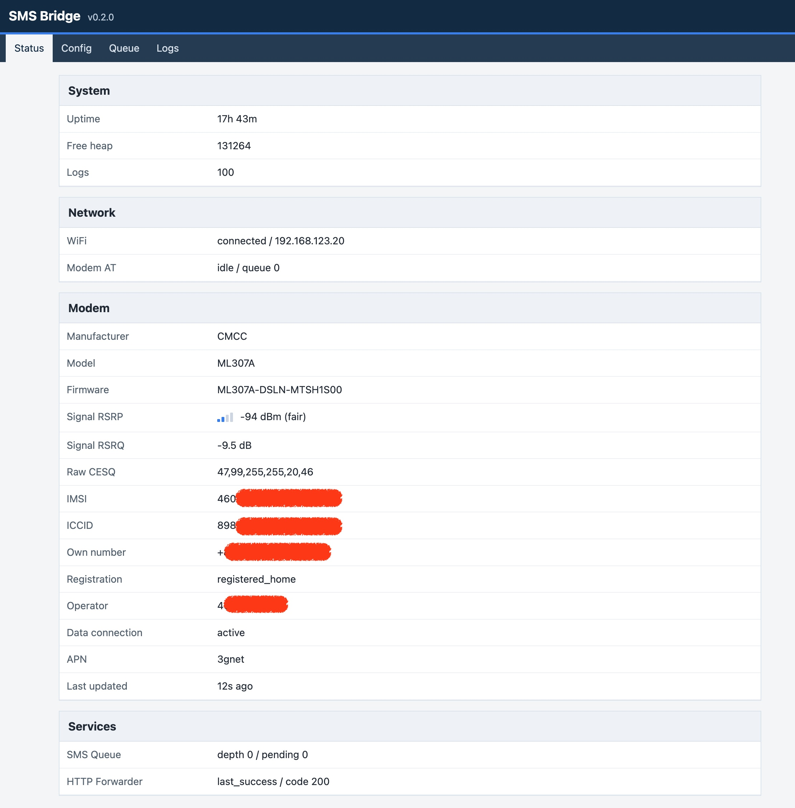

# ESP32 SMS Bridge

ESP32 SMS Bridge is firmware for an ESP32-C3 connected to an ML307R-compatible
4G modem. Its main goal is to receive SMS messages reliably, queue them locally,
and forward them through an HTTP push channel while keeping device status visible
through a lightweight web interface.

This project is currently an early usable firmware. It is intended for technical
users who are comfortable preparing their own build environment, editing local
configuration files, flashing ESP32 firmware, and reading serial logs.

## Core Features

- SMS receiving in PDU mode.
- Long SMS merge support.
- Local SMS queue with retry/backoff forwarding.
- Bark HTTP push forwarding.
- Lightweight web dashboard for status, logs, queue, configuration, and modem
  information.
- ML307R modem identity, signal, registration, APN, and data connection display.
- Data connection guard based on ML307R `AT+MIPCALL?` / `AT+MIPCALL=0,1`.
- USB Serial AT Console for debugging through the firmware `modem_at` layer.

## Web Dashboard



The dashboard provides a quick overview of WiFi status, SMS queue state, modem
identity, signal quality, network registration, APN, data connection state, and
recent runtime information.

## Hardware Assumptions

- ESP32-C3 development board.
- ML307R or ML307R-compatible 4G modem.
- UART wiring:
  - ESP32 GPIO3 / TX to modem RX
  - ESP32 GPIO4 / RX to modem TX
- UART baud rate: `115200`.
- Stable 5V power for the modem.
- SIM card with SMS receiving enabled.

The modem can draw high current during network activity. Unstable power can
cause AT timeouts, modem resets, missed URCs, or failed SMS reception.

## Runtime and Build Environment

You are responsible for installing and configuring the build environment.

Required tools:

- Python 3
- Git
- PlatformIO Core, or VS Code with the PlatformIO extension
- USB serial driver required by your ESP32-C3 board, if any

Project dependencies are declared in `platformio.ini` and resolved by
PlatformIO. The current firmware dependency is:

- `pdulib@^0.5.11`

Main PlatformIO environments:

- Firmware build/upload: `esp32-c3-devkitm-1`
- Native tests: `native`

Refer to the PlatformIO documentation for installation and environment setup.
This repository documents the project-specific build and configuration flow, not
a general PlatformIO tutorial.

## Configuration

This project does not use captive-portal WiFi provisioning as the primary setup
path. For non-developer use, a preconfigured firmware build is the recommended
setup path.

Source builds can provide fallback configuration through local header files.
The relevant examples are:

- `include/local_wifi_config.example.h`
- `include/local_push_config.example.h`

These files show the expected configuration fields:

- WiFi SSID and password.
- Bark server URL and device key.

Local configuration files should not be committed.

Runtime configuration can also be stored in device NVS after saving through the
web configuration page. For first boot and reproducible builds, the local header
files are the expected setup path.

## Build, Test, Flash, and Monitor

Build the firmware:

```bash
pio run
```

Upload the firmware:

```bash
pio run -t upload
```

Open the serial monitor:

```bash
pio device monitor
```

Run native tests:

```bash
pio test -e native
```

## First Boot

After flashing, open the serial monitor and wait for the boot logs. When WiFi
connects, the firmware prints the assigned IP address.

Open the printed IP address in a browser to access the web dashboard. The web UI
shows runtime status, modem information, SMS queue state, logs, and current
configuration status.

The USB Serial AT Console is intended for debugging only. Normal SMS reception,
queueing, and forwarding do not require manual AT commands.

## Bug Reports

Please open a GitHub Issue for bugs.

Useful details include:

- Firmware version.
- ESP32 board model.
- Modem model and firmware version, if available.
- SIM operator.
- Serial boot logs.
- Reproduction steps.
- Relevant web dashboard or log screenshots, if available.

Do not include real IMSI, ICCID, phone numbers, WiFi passwords, Bark device keys,
or other secrets in public issues.

## Contributing

Pull requests are welcome for focused fixes and reliability improvements.

Important project rules:

- `modem_at` is the only module allowed to read from or write to `Serial1`.
- SMS reception must not depend on HTTP forwarding, the web UI, or manual AT
  debugging.
- Received SMS messages must be parsed and queued before forwarding.
- Long operations should use explicit timeouts and avoid blocking SMS reception.
- Web handlers must not perform long modem operations directly.

Before submitting a pull request, run:

```bash
pio test -e native
pio run
```

Add or update native tests for parser, queue, retry, configuration, web, or
state-machine changes.

## License

TBD.
